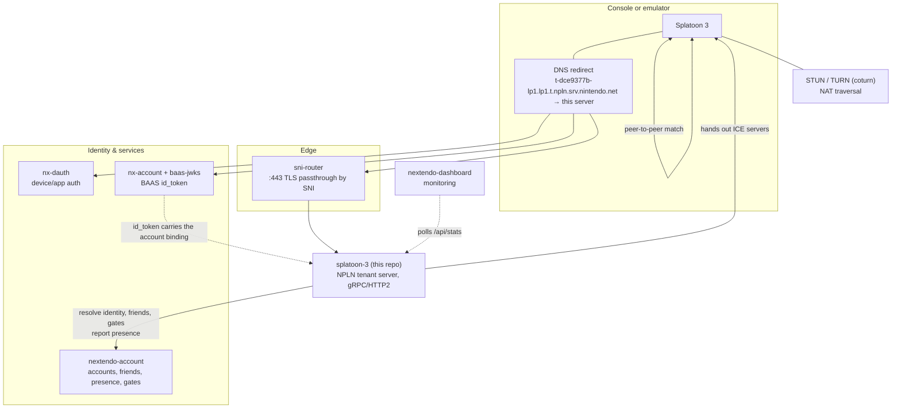

# Architecture

## Where this server sits



The NEX game servers in the stack (`splatoon-2`, `mario-kart-8-deluxe`, …) sit in the same place, but
speak a completely different protocol. Everything to the right of this server is shared.

## Inside the server

```
main.go                 the binary: configuration, wiring, shutdown
gates.go                identity + the online gates (same contract as the NEX servers)
revoked.go              the nx2 token denylist
utility.go              envOr / envOrInt / loadNextendoSecret
npln/
  config                every tunable, all from the environment
  identity              BAAS id_token → Nextendo account → NPLN ids
  token                 the ES256 access / matchmaking / delegation tokens
  account               the nextendo-account client (identity, friends, gates, presence)
  names                 NPLN resource names, built and parsed in one place
  nplnerr               gRPC statuses with the NError detail codes the client acts on
  server                gRPC assembly, metadata validation, authentication, logging
  presence              the presence hub: game → us → friends, and back to the account server
  store                 the small JSON persistence layer
  services/
    auth                Auth, UserService
    friends             Friends, PresenceService
    matchmaking         GameSessionService, Matchmaker, the room registry, ICE
    messaging           Messaging, LobbyMessaging
    maintenance         MaintenanceScheduleService
    toyohr              Schedule, Fest, CloudSave, GameRecord, Replay/Locker/Canola/CoopScenario, UserScreening
    ugc                 Ugcstore, Screening, attachments
  dashboard             /api/stats and the UGC HTTP endpoints
  wire                  which implementation answers which NPLN service
protocol/               the vendored NPLN .proto tree (upstream layout, untouched)
gen/                    the generated Go bindings (committed, so a plain `go build` works)
```

Three rules hold the design together:

1. **The account server owns identity and the friend graph.** This server stores no accounts, no
   friendships and no nicknames. It resolves them per request and caches nothing that could go stale
   into somebody else's identity.
2. **Rooms are transient, records are persistent.** Game sessions, tickets, presences and messages
   live in memory and are reaped. Cloud saves, game records, documents and reports are JSON files
   under the data directory.
3. **The client is the authority on its own data.** Peer addresses, room properties, presence
   attributes and save payloads are stored and echoed verbatim. This server never invents a value the
   game is going to interpret.

## What happens from boot to match

1. **Device and account auth.** The console does its `nx-dauth` / BAAS dance and ends up with a BAAS
   `id_token` for the player. Nothing in this server is involved yet.
2. **DNS + TLS.** Splatoon 3 opens an HTTP/2 connection to its NPLN tenant host. DNS points that name
   here; `sni-router` forwards the still-encrypted stream to this process, which terminates TLS.
3. **`Auth.IssuePrearrangedUserToken`.** The `id_token` is verified, resolved to a Nextendo account
   (see below), checked against the online gates, and answered with an access token + refresh token.
   Every later call carries `authorization: bearer <access token>` and `npln-tenant-id`.
4. **Boot queries.** `MaintenanceScheduleService.SubscribeMaintenanceSchedules` (is the service up?),
   `Schedule.SelectVsSchedules` / `SelectCoopSchedules` / `SelectSeasonSchedules` (what is live?),
   `CloudSave.GetSaveRecord` (the online save), `FestService.SelectFestSchedule` (is there a fest?).
5. **Social.** `Friends.ActivateUser`, then the two long-lived streams:
   `Friends.SubscribeFriendUsers` (who are my friends) and `PresenceService.SubscribePresences`
   (what are they doing), plus `PresenceService.KeepAlive` pushing the player's own presence.
   `Messaging.RecvMessage` opens the invite mailbox.
6. **Matchmaking.** `Matchmaker.CreateMatchmakingTicket` + `TrackMatchmakingTicket`, or
   `GameSessionService.CreateGameSessionCreationTicket` when the player hosts a private room. The
   matchmaker places them into a room and mints a matchmaking id token per player.
7. **NAT traversal and play.** `AllocateIceServerSet` gives the STUN/TURN servers; the host publishes
   its reachable address with `SyncGameSession`; joiners read it back. Gameplay traffic is
   peer-to-peer — this server is out of the loop.
8. **While playing.** `SyncGameSession` keeps the room alive, `KeepAlive` keeps presence fresh, and
   this server reports the set of players to `nextendo-account` every 30 seconds so friends see
   "playing Splatoon 3".

## Identity, precisely

```
BAAS id_token
  ├─ sub          the console user's BAAS/NSA id  ─────────────┐
  ├─ bs:did       the device account id                        │
  ├─ nintendo.ai  the title id (must be Splatoon 3)            │
  └─ nnex         a signed "nx2." Nextendo token (emulator)    │
                        │                                       │
        HMAC-verified ──┘                                       │
                        ▼                                       ▼
                 Nextendo account PID          nextendo-account /internal/resolve?baas=
                        │                                       │
                        └───────────────┬───────────────────────┘
                                        ▼
             u-<base32>  NPLN user id     ← identical to nextendo-account's nplnUserID(pid)
             a-<base32>  NPLN account id
             short_id    the account PID
```

Two paths in, and both end at a **Nextendo account PID**:

- the **emulator** embeds a signed `nx2.` token in the `id_token`'s `nnex` claim, which proves the
  account cryptographically (the same binding `splatoon-2` enforces at `LoginEx`);
- a **retail CFW Switch** sends a genuine `id_token` with no `nnex`, so the NSA id in `sub` is
  resolved against the account directory.

If neither works, the login is **refused**. There is no default account, no "most recent" account and
no cache of "who is calling" — see [FRIENDS.md](FRIENDS.md) for what happens when a server gets that
wrong.

The NPLN user id for slot 0 is derived with the *same* HMAC as `nextendo-account`'s `nplnUserID`, from
the *same* shared secret. That is what makes the friend graph line up: the account server tells us a
friend is `u-qoahvkaf4bclq6uqu6in`, and that is exactly the id that friend's own console logs in as.
There is a unit test whose only job is to keep those two derivations identical.

## Trust boundaries

- **The gRPC interceptor is the only place identity is established.** A method not listed in
  `noAuthMethods` cannot run without a verified access token in its context, so no service can invent
  a caller.
- **The `uid` metadata field is checked against the token**, never trusted on its own.
- **A player may only act on their own resources.** Listing another user's friends, syncing somebody
  else's room, writing another player's save or rewriting another player's document are all refused.
  Acting for a *second local player* requires a delegation token this server signed.
- **`/internal/*` on the account server is a control plane.** This server reaches it with the shared
  internal key over the private network; it is never exposed to consoles.
- **`/api/stats` needs `DASH_TOKEN`.** It lists players, PIDs and IP addresses.
- **Attachment upload URIs are one-shot and expire.** The blob id is random, so an URI cannot be
  guessed or replayed.
